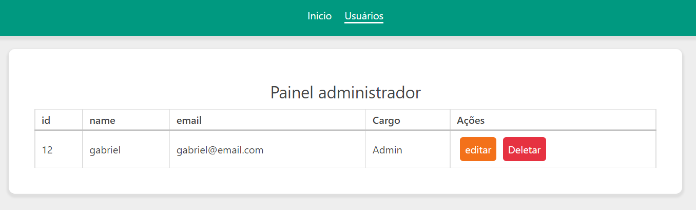

# CRUD-NodeJs-e-VueJs-com-VueRouter

Esse projeto se trata de uma vesão bem simples da integração entre uma API nodejs com um front end em vueJs.

O foco do projeto não foi o frontend ou o backend, mas somente a integração.

.

# Como usar?
Além de que você precisa iniciar o backend com o NPM, você precisa executar o frontend usando o "yarn serve".

# Como cadastrar um usuário?
Acesse o endereço:
[http://localhost:8081/register](http://localhost:8081/register) e crie um usuário.

Depois no banco de dados altere esse usuário para o role = 1, isso o torna administrador e libera acesso as demais telas.

Agora acesse o endereço:
[http://localhost:8081](http://localhost:8081) para acessar as opções.
